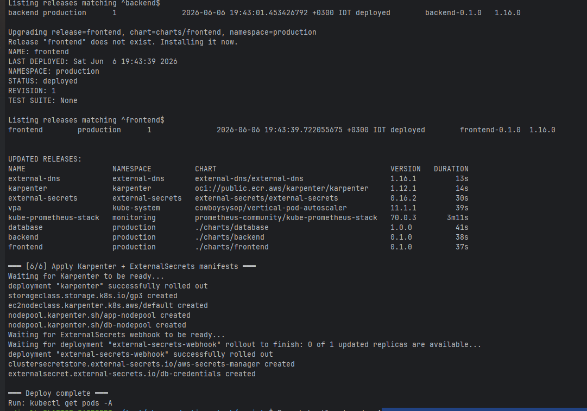
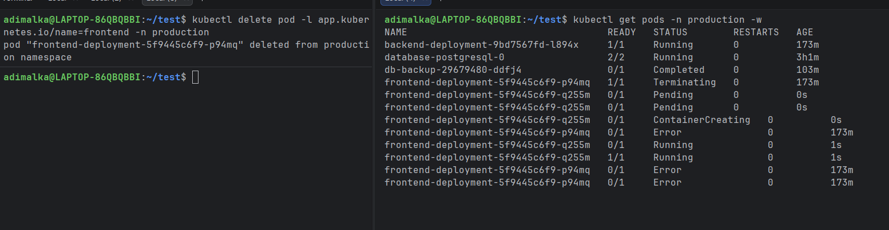
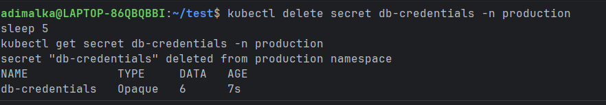
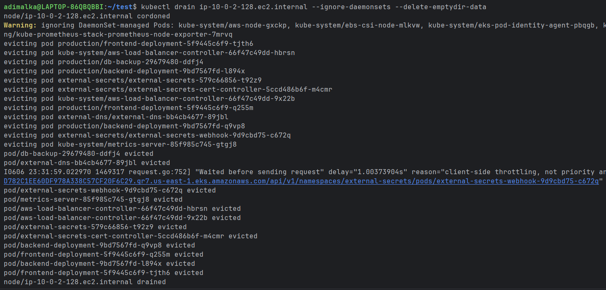
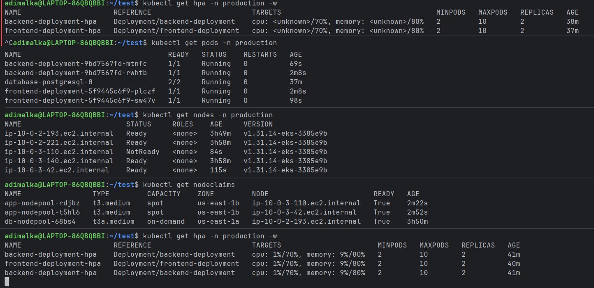

# EKS Production Stack

Production-grade EKS cluster with a three-tier application (frontend + backend + database), fully managed via Terraform, Helm charts, and Helmfile.

## Architecture

```
AWS
├── VPC (custom module)
│   ├── 2 Public subnets  — NAT Gateway, ALB entry point
│   └── 2 Private subnets — EKS nodes (tagged for internal-elb and karpenter discovery)
│
├── EKS Cluster  (terraform-aws-modules/eks v21, AWS provider ~> 6.46)
│   ├── OIDC provider (IRSA enabled)
│   └── system node group — t3.medium, min 1 / max 3
│       └── taint: CriticalAddonsOnly=true:NoSchedule
│
├── Karpenter  (EKS submodule v21, Pod Identity)
│   ├── Controller IAM role
│   ├── Node IAM role + instance profile
│   └── SQS queue + EventBridge rules (spot interruption)
│
├── IRSA Roles  (terraform-aws-modules/iam)
│   ├── external-dns      — Route53 ChangeResourceRecordSets
│   ├── external-secrets  — Secrets Manager GetSecretValue
│   └── backup            — S3 PutObject/GetObject on backup bucket
│
└── S3 backup bucket
    ├── Versioning + SSE-AES256
    └── Lifecycle: Standard-IA (30d) → Glacier (60d) → Delete (90d)
```

## Node Strategy

Karpenter handles workload node provisioning dynamically via two NodePools (defined in Helm/Helmfile):

| NodePool | Labels | Instances | Purpose |
|---|---|---|---|
| `app-nodepool` | `role=app` | spot + on-demand, c/m/r | Frontend + Backend, External Secrets |
| `db-nodepool` | `role=db` | on-demand only, r-family/t3a | Database (tainted) |

The single managed node group (`system`) runs only Karpenter, CoreDNS, and other critical add-ons.

## Helm Stack

### Charts

| Chart | Type | Key features |
|---|---|---|
| `charts/frontend` | Custom | Deployment, Service, Ingress (ALB), HPA, VPA, ServiceMonitor |
| `charts/backend` | Custom | Same as frontend + ConfigMap for DB env vars, secretKeyRef for credentials |
| `charts/database` | Bitnami wrapper | PostgreSQL 18.4.0, gp3 persistence, metrics exporter, node affinity, backup CronJob |

### Node Placement

- **Frontend + Backend**: `preferredDuringSchedulingIgnoredDuringExecution` → `role=app` nodes
- **Database**: `requiredDuringSchedulingIgnoredDuringExecution` → `role=db` nodes + toleration for `workload=database:NoSchedule`

### Autoscaling

- **HPA** (frontend + backend): CPU > 70%, memory > 80%, min 2 / max 10 pods
  - Scale-up: doubles pod count every 60s, no stabilization delay
  - Scale-down: 5-minute stabilization window, removes up to 10% every 60s
- **VPA** (all services): `updateMode: Off` — recommendations only, no automatic restarts

### Monitoring (kube-prometheus-stack)

- Prometheus: 7d retention, gp3 persistent storage
- ServiceMonitors on frontend, backend, database
- `serviceMonitorSelectorNilUsesHelmValues: false` — discovers all namespaces
- PrometheusRule: `HighErrorRate` alert (>5% for 5 minutes) on backend
- Grafana dashboards auto-provisioned: node-exporter (1860), k8s-pods (6417), PostgreSQL (9628), Node.js (11159)

### Database Backup

CronJob pattern: **initContainer + emptyDir volume**

```
initContainer (amazon/aws-cli)
  └── copies AWS CLI binary → /tools/ (emptyDir)

main container (bitnami/postgresql:18.4.0)
  └── pg_dump | gzip | aws s3 cp → S3
```

- Schedule: every 6 hours (`0 */6 * * *`)
- Credentials: from `db-credentials` Secret (ExternalSecrets)
- S3 access: via IRSA ServiceAccount (no hardcoded keys)
- `concurrencyPolicy: Forbid` — no overlapping backup jobs

### Helmfile Release Order

```
kube-prometheus-stack  ┐
external-secrets       ├── independent (deploy in parallel)
external-dns           │
karpenter              ┘
database  →  needs: external-secrets
backend   →  needs: database
frontend  →  needs: backend
```

## Repository Structure

```
.
├── scripts/
│   ├── deploy.sh          # End-to-end deployment script
│   ├── destroy.sh         # End-to-end tear down script
│   ├── generate-values.sh # Maps Terraform outputs to Helm/Karpenter
│   └── create-secrets.sh  # Bootstraps AWS Secrets Manager
│
├── terraform/
│   ├── main.tf            # VPC, EKS, Karpenter modules
│   ├── s3.tf              # Backup bucket + lifecycle policy
│   ├── irsa.tf            # IRSA roles for ExternalDNS, ExternalSecrets, backups
│   ├── variables.tf       # Variable definitions
│   ├── terraform.tfvars   # Variable values — edit this to customize
│   └── outputs.tf         # ARNs needed by scripts
│
├── helm/
│   ├── helmfile.yaml      # All releases with dependency order
│   ├── manifests/         # Karpenter NodePools, ExternalSecrets resources, gp3 StorageClass
│   ├── charts/            # Local charts (frontend, backend, database)
│   └── values/            # Per-release override files
│
└── TROUBLESHOOTING.md     # Detailed post-mortem and fixes log
```


## Project Showcase

This project successfully demonstrates the following enterprise-grade Kubernetes capabilities:

### 1. Infrastructure as Code (IaC) Automation
Shows the successful automated deployment of the entire cluster, Karpenter nodes, and application stack using a single `helmfile sync` command.
<br><br>


### 2. Self-Healing & High Availability
Demonstrates killing a `frontend` pod and watching the Kubernetes ReplicaSet instantly recreate it (Stateless). It also demonstrates identical behavior for the PostgreSQL `database` pod, recovering its state with the `gp3` EBS volume (Stateful).
<br><br>


### 3. Automated Secret Recovery
Demonstrates deleting the local `db-credentials` Kubernetes secret. Within 7 seconds, the `ExternalSecrets` Operator detects the missing secret and automatically recreates it by fetching the values from AWS Secrets Manager.
<br><br>


### 4. Node Draining, Karpenter Auto-Scaling & Metrics Recovery
Demonstrates performing a `kubectl drain` on an active node, which triggers several self-healing mechanisms simultaneously:
- **Karpenter Provisioning:** As application pods are evicted, Karpenter instantly recognizes the pending pods and provisions brand new `t3.medium` Spot instances (`NodeClaims`) within ~2 minutes to catch the load.
- **Metrics Server Recovery (HPA):** The `metrics-server` pod was also evicted during the drain. The accompanying screenshot shows the `HPA` temporarily falling back to `<unknown>` CPU usage. A few minutes later, the metrics-server finishes restarting on the new node, and the HPA successfully resumes tracking CPU metrics (`cpu: 1%/70%`).
- **Node Consolidation:** After 30 seconds of being empty, Karpenter automatically terminates the drained nodes (`consolidationPolicy: WhenEmptyOrUnderutilized`) to save costs.
<br><br>

<br><br>


## Prerequisites

- Terraform >= 1.15
- Helm >= 3.x + helm-diff plugin
- Helmfile >= 1.5
- AWS CLI configured with sufficient permissions
- kubectl configured

## Usage

We've automated the entire deployment and teardown process via bash scripts.

### 1. Deploy the Stack

To build the infrastructure (Terraform), authenticate kubectl, generate the required Helm values dynamically from Terraform outputs, and deploy the application stack (Helmfile):

```bash
export DB_PASSWORD="YourSecurePassword123"
./scripts/deploy.sh
```

### 2. Verify

Once the `deploy.sh` script completes, you can verify that all workloads, Karpenter nodes, and databases are running:

```bash
kubectl get pods -A
kubectl get nodeclaims
```

### 3. Teardown

To destroy the entire infrastructure, ensuring that webhooks and Kubernetes resources are gracefully cleaned up before Terraform destroys the cluster:

```bash
./scripts/destroy.sh
```

## Troubleshooting

If you encounter issues during deployment (e.g., Karpenter failing to find subnets, Pods stuck in `Pending`, or `ExternalSecret` failing to authenticate), please refer to the comprehensive [TROUBLESHOOTING.md](./TROUBLESHOOTING.md) which contains solutions to common bugs.
